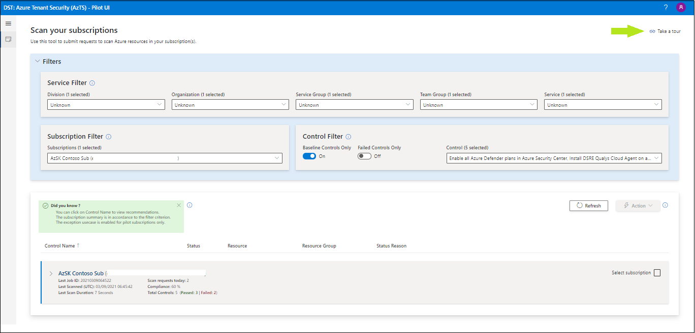
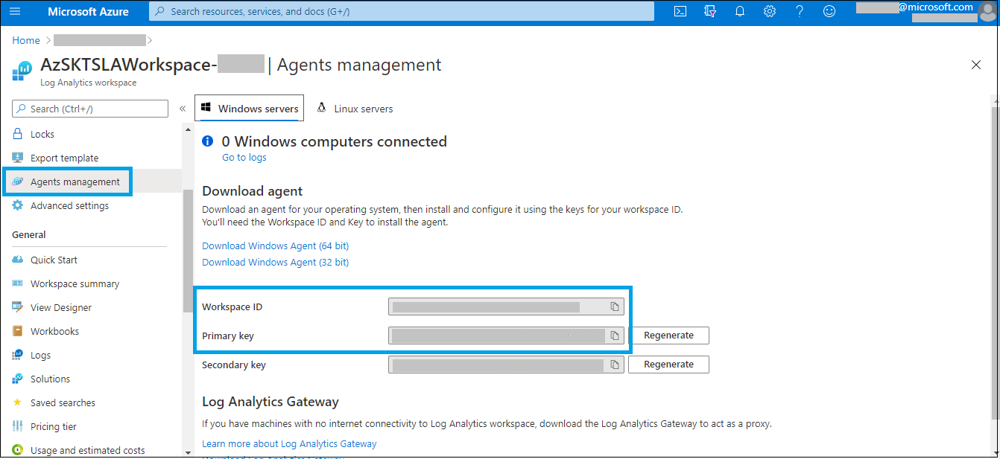

> The Azure Tenant Security Solution (AzTS) was created by the Core Services Engineering & Operations (CSEO) division at Microsoft, to help accelerate Microsoft IT's adoption of Azure. We have shared AzTS and its documentation with the community to provide guidance for rapidly scanning, deploying and operationalizing cloud resources, across the different stages of DevOps, while maintaining controls on security and governance.
<br>AzTS is not an official Microsoft product – rather an attempt to share Microsoft CSEO's best practices with the community..

</br>

# Running AzTS solution from UI

## Content

- [Overview](Readme.md#overview)
- [Prerequisite](Readme.md#prerequisite)
- [FAQ](Readme.md#frequently-asked-questions)


## Overview

Tenant reader solution provides a UI-based tool that can be used to perform on-demand scans to verify your fixes sooner, check reasons for control failures and view latest scan results. This tool leverages you current subscription permissions to show you subscriptions that you have the ability to request scans for. 

## Prerequisite

1. Signed in user must have one of the following permission at subscription or resource group scope: Owner, Contributor, ServiceAdministrator, CoAdministrator, AccountAdministrator, Security Reader, Security Admin.
2. Subscription scan should have completed for the day. The steps to validate this has been specified under [this section](Readme.md#2-verifying-that-tenant-security-solution-installation-is-complete).


The UI is fairly self-explanatory and also has a "Guided Tour" feature that should show you the basic usage workflow. We recommend that you create a custom domain name for your UI. For steps to create custom domain, refer this [link](https://docs.microsoft.com/en-us/azure/app-service/app-service-web-tutorial-custom-domain).

&nbsp;&nbsp; 

> **Note:**
> 1. If you have been recently granted access, you either need to wait for the next scheduled scan to read the latest RBAC data or request an existing owner of a subscription to perform an ad hoc scan for the subscription using AzTS UI.
>
> </br>

</br>

### **Frequently Asked Questions**

</br>

**Q: Where can I find AzTS UI URL?**

Link to the AzTS UI is provided at the end of installation command ```Install-AzSKTenantSecuritySolution``` (as shown below).
&nbsp;&nbsp; 

**Q: How do I update org-subscription mapping for my subscription(s)?**

By default, there is no service mapping for your subscription. Therefore, you see the 'Unknown' value is the Service Filter dropdown. To add service mapping, follow the steps below:

#### Step 1 of 2: Prepare your org-subscription mapping
In this step you will prepare the data file with the mapping from subscription ids to the org hierarchy within your environment. The file is in a simple CSV form and should appear like the one below. 

> Note: You may want to create a small CSV file with just a few subscriptions for a trial pass and then update it with the full subscription list for your org after getting everything working end-to-end.

A sample template for the CSV file is [here](TemplateFiles/OrgMapping.csv):

 

The table below describes the different columns in the CSV file and their intent.

| ColumnName  | Description | Required?	|Comments|
| ---- | ---- | ---- | ---- |
| OrganizationName | Name of Organization(s) within your enterprise | No | This you can consider as level 1 hierarchy for your enterprise |
| DivisionName | Name of Division(s) within your organization | No | This you can consider as level 2 hierarchy for your enterprise |
| ServiceGroupName | Name of Service Line/ Business Unit within an organization | No | This you can consider as level 3 hierarchy for your enterprise |
| TeamGroupName | Name of Team(s) within an organization | No | This you can consider as level 4 hierarchy for your enterprise |
| ServiceName | Name of Service(s) within your organization | No | This you can consider as level 5 hierarchy for your enterprise |
| SubscriptionId | Subscription Id belonging to a org/servicegroup | Yes |
| SubscriptionName | Subscription Name | Yes |

<br/>

> **Note**: Ensure you follow the correct casing for all column names as shown in the table above.

<br/>

#### Step 2 of 2: Upload your mapping to the Log Analytics (LA) workspace

In this step you will import the data above into the LA workspace created during Tenant Security setup. 

 **(a)** Locate the LA resource that was created during Tenant Security setup in your subscription. This should be present under Tenant Security resource group. After selecting the LA resource, copy the Workspace ID and primary key from the portal as shown below:

 
 
 **(b)** To push org Mapping details, copy and execute the script available [here](Scripts/AzTSPushOrgMappingEvents.ps1) (for Gov subs use script [here](Scripts/AzTSPushOrgMappingEvents.Gov.ps1)) in Powershell. You will need to replace the CSV path, Workspace ID, and primary key with its approriate value in this PowerShell script.

<br/>

 > **Note**: Due to limitation of Log Analytics workspace, you will need to repeat this step every 90 days interval.

<br/>
