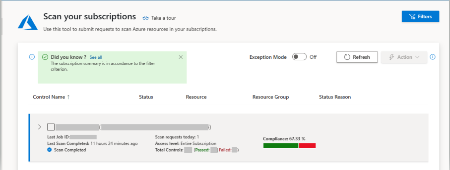

> The Azure Tenant Security Solution (AzTS) was created by the Core Services Engineering & Operations (CSEO) division at Microsoft, to help accelerate Microsoft IT's adoption of Azure. We have shared AzTS and its documentation with the community to provide guidance for rapidly scanning, deploying and operationalizing cloud resources, across the different stages of DevOps, while maintaining controls on security and governance.
 AzTS is not an official Microsoft product – rather an attempt to share Microsoft CSEO's best practices with the community.
 

# AutoRemediation
This feature is not enabled by default. Below is the AzTS UI with AutoRemediation feature off by default:

To enable this feature for your AzTS setup, please follow steps mentioned below:

1. Open the [Azure portal](https://portal.azure.com/).
2. Navigate to AzTS host subscription -> AzTS host resource group.
3. Go to required AzTS API app service(AzSK-AzTS-WebApi-xxxxx).
4. Go to Configuration under Settings.
5. Click on "New application setting" to add required appsettings.
6. Add **FeatureManagement__AutoRemediation** as the Name of the appsetting.
7. Add **true** as the value of the appsetting.
8. Add **RemediationFeatureConfiguration__IsEnabled** as the Name of the appsetting.
9. Add **true** as the value of the appsetting.
10. Add **UIConfigurations__RemediationFeatureConfiguration__IsEnabled** as the Name of the appsetting.
11. Add **true** as the value of the appsetting.

12. Save these settings. This will restart AzTS API app service. 

When you open the AzTS-UI, you should now see a "Remediation Mode" toggle button visible on the screen.

It is turned off on UI load by default. Once you turn on the Remediation Mode, you will see an option to select the failing controls (presently [limited controls](../Scripts/RemediationScripts/ControlsEligibleForRemediationThroughUI.md) are supported for remediation via the AzTS-UI).
You can select multiple such failing controls and then download zipped folder containing scripts and other files necessary for remediation by clicking on the "Download Remediation Package" under the "Actions" button. Detailed steps about using this zip folder for remediation can be found [here](../Scripts/RemediationScripts/Instructions.pdf).

