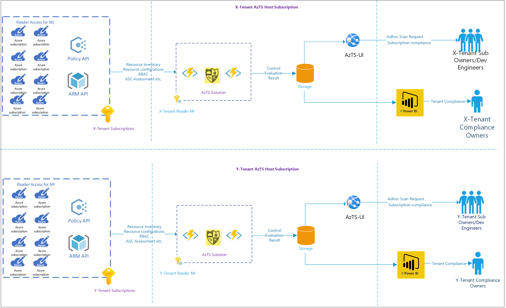
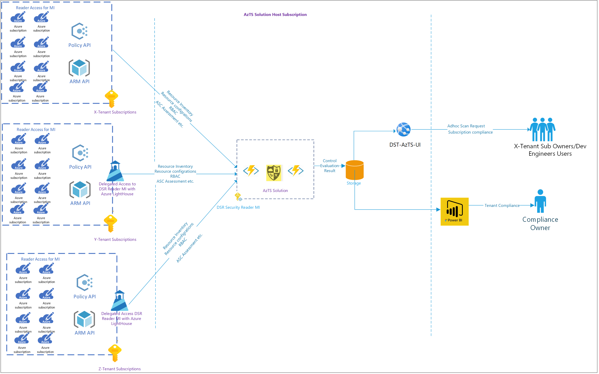
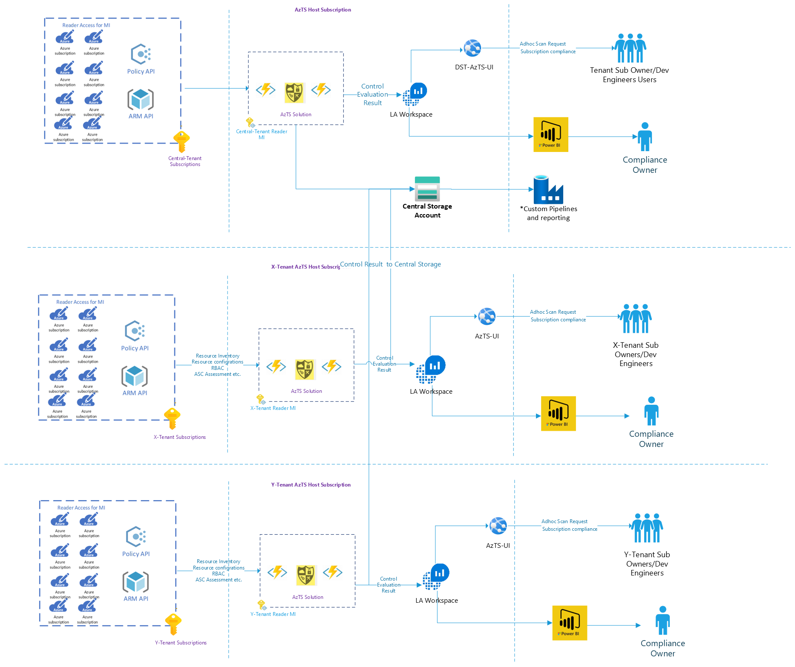
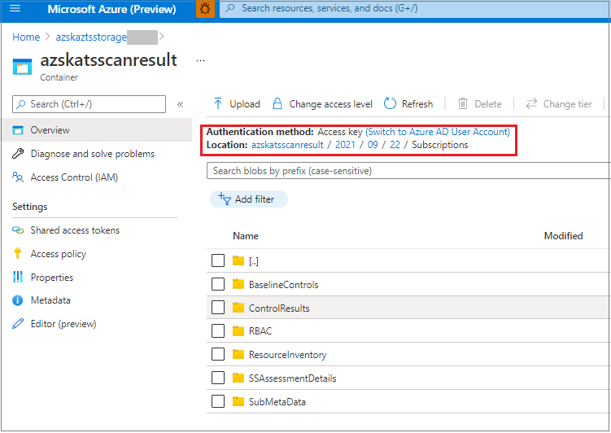

> The Azure Tenant Security Solution (AzTS) was created by the Core Services Engineering & Operations (CSEO) division at Microsoft, to help accelerate Microsoft IT's adoption of Azure. We have shared AzTS and its documentation with the community to provide guidance for rapidly scanning, deploying and operationalizing cloud resources, across the different stages of DevOps, while maintaining controls on security and governance.
<br>AzTS is not an official Microsoft product – rather an attempt to share Microsoft CSEO's best practices with the community.

# Cross- and multi-Tenant AzTS Onboarding

## Overview

Enterprise IT organizations creates multiple tenants to manage and deliver resources based on business needs. To get security visibility across multiple tenants, AzTS provides three kinds of solutions.

- [Onboard AzTS Solution per Tenant](#1-onboard-azts-solution-per-tenant): Standalone installation, scanning and reporting 
- [Single AzTS setup to scan cross- and multi-tenant](#2-single-azts-setup-to-scan-cross--and-multi-tenant): Use delegated identity on target tenant(s), scan from single AzTS setup
  - [Azure Lighthouse approach](#2a-azure-lighthouse-approach)
  - [Multi-tenant AAD Application approach (**Recommended**)](#2b-multi-tenant-aad-application-approach-recommended)
- [ Onboard AzTS Solution per Tenant with central visibility for scan result](#3-onboard-azts-solution-per-tenant-with-central-visibility-for-scan-result)   


## 1. Onboard AzTS Solution per Tenant

Standalone installation, scanning and reporting can be done by onboarding AzTS solution per Tenant.
You will need to follow [setup steps](/01-Setup%20and%20getting%20started/README.md) for each Tenant. 


Below diagram depicts high-level flow for standalone setup.



## 2. Single AzTS setup to scan cross- and multi-tenant

Single AzTS setup can be used on trusted tenants to get visibility/reporting at single location. AzTS supports two approaches to this solution.

&nbsp;a. Azure Lighthouse approach.<br>
&nbsp;b. Multi-tenant AAD Application approach (**Recommended**)

### 2a. Azure Lighthouse approach
In this approach AzTS leverages [Azure Lighthouse](https://docs.microsoft.com/en-us/azure/lighthouse/overview) delegated reader access to central scanning Managed Identity on cross-tenant subscriptions and perform AzTS scan seamlessly. 

Below diagram depicts high level flow for Azure Lighthouse approach



 >**Note:**  This approach has below limitations <br/>1. Azure Lighthouse delegated access is given at subscription level. Whenever new subscription added into tenant, we need to provide delegated access on that sub <br/>2. Reader access using Azure Lighthouse can request API's that start with https://management.azure.com. However, requests that are handled by an instance of a resource type (such as Graph, RBAC details, Key Vault secrets access or storage data access) aren't supported with Azure Lighthouse. Due to this limitation, below AzTS controls will give false positive results<br/>* Azure_Subscription_AuthZ_Dont_Grant_Persistent_Access_RG <br/>* Azure_Subscription_AuthZ_Dont_Grant_Persistent_Access<br/>* Azure_Subscription_AuthZ_Dont_Use_NonAD_Identities<br/>* Azure_Subscription_AuthZ_Remove_Deprecated_Accounts <br/>3. AzTS UI will not be accessible to non-hosting (in above diagram Y and Z) tenant users. 


Follow below steps to onboard subscription from different tenants to AzTS scanning

1. Setup AzTS Solution on host tenant subscription

    Follow [setup steps](/01-Setup%20and%20getting%20started/README.md) on host subscription. If you have already performed setup, you can skip this step. 

2. Get AzTS scanning MI principal id
   
   In step 3 of [setup](/01-Setup%20and%20getting%20started/README.md), we have created central scanning user managed identity. We will need to navigate to MI resource to get principal id. 

   Go Azure Portal --> Subscription where central scanning MI resource created --> Click on MI Hosting RG --> Click on MI resource --> Copy object id 

3. Provide reader access to AzTS scanning MI on cross-tenant subscriptions using Azure Lighthouse. 
> **Note:** Below step needs be performed only on cross tenant subscriptions and not on hosting tenant subscriptions where AzTS solution is installed.  

```PowerShell
# 1. Install Azure Lighthouse PS module
Install-Module -Name Az.ManagedServices -AllowClobber -Scope CurrentUser -repository PSGallery

# 2. Provide Reader Access on cross tenant subscription. 
# **Important Note:** Below step needs to be repeated for each cross-tenant subscription that needs to be scanned using AzTS solution

#  2.1 Set the context to target subscription 
    Set-AzContext -Subscription "<TargetSubscriptionId>"
#  2.2 Provide reader access using 
    $managedServiceDefinition = New-AzManagedServicesDefinition -Name "AzTS Scanner Managed Service" -Description "AzTS Scanning MI Access" -ManagedByTenantId "<HostTenantId>" -PrincipalId "<CentralScanningMIPrincipalId>" -RoleDefinitionId "acdd72a7-3385-48ef-bd42-f606fba81ae7" 
    #"acdd72a7-3385-48ef-bd42-f606fba81ae7" is reader role definition id
    New-AzManagedServicesAssignment -RegistrationDefinitionId $managedServiceDefinition.Id

```

After access is provided to target subscription, next scheduled trigger will pick up subscription from cross tenant and perform scan. You can follow steps [here](../02-Monitoring%20security%20using%20AzTS/README.md) to create security compliance dashboard.

### 2b. Multi-tenant AAD Application approach (Recommended)
In this approach AzTS uses multi-tenant AAD application as the central scanning identity having required access over all the trusted tenants to overcome limitations of Azure Lighthouse approach and to get security visibility across trusted tenants.

Below diagram depicts high level flow for Multi-tenant AAD Application approach


Follow below steps to setup the AzTS Solution and onboard tenants to be scanned

1. Setup AzTS Solution in **multi-tenant mode** on host tenant subscription

    Follow [steps](MultiTenantSetupWithAADApp.md/#1-steps-to-install-multi-tenant-azts-solution) on host subscription to setup AzTS solution in multi-tenant mode. If you have already performed setup for multi-tenant mode, you can skip this step. 
    
2. Onboard the tenants to be scanned to the AzTS solution
    
    Follow [steps](OnboardTenantToAzTS.md/#onboarding) to onboard all the tenants for which we need security visibility.
    > **Note:** Host tenant should also be onboarded to AzTS solution if security visibility is needed for it.

After the tenants to be scanned are onboarded, next scheduled trigger will pick up subscriptions across onboarded tenants and perform the scan

## 3. Onboard AzTS Solution per Tenant with central visibility for scan result

To overcome limitation of second approach and to get visibility across trusted tenants, you can install standalone AzTS setup per tenant and leverage central repository to get security scan telemetry. 

Below diagram depicts high level flow for central visibility approach



 _\* All scan results and inventory captured by AzTS Scanner are stored in a container in a central storage account. Data stored in this container cannot be used directly for reporting. To perform additional operations on this data, you can create a custom pipeline which reads the data stored in this container and uploads it in a data store that can be used for further reporting._

Follow below steps to onboard AzTS Solution per Tenant with central visibility:

1. Start by onboarding AzTS Solution in your central tenant by following the setup steps provided [here](/01-Setup%20and%20getting%20started/README.md). 

2. After setting up AzTS in your central tenant, you need to get the connection string of the storage account that was created as part of the setup in step (1). To get the connection string you can either: <br>
a. Run the following PowerShell command in the same session in which you had installed AzTS. 

    ``` PowerShell
    # 1. Get storage account info
    $resourceInfo = Get-AzResource -ResourceId "$($DeploymentResult.Outputs.storageId.Value)"

    # 2. Get storage account key
    $storageAccountKey = Get-AzStorageAccountKey -ResourceGroupName $resourceInfo.ResourceGroupName -Name $resourceInfo.Name

    # 3. Form storage account connection string. This connection string will be required in the next step.
    $connectionString = 'DefaultEndpointsProtocol=https;AccountName=' + $resourceInfo.Name + ';AccountKey=' + $storageAccountKey[0].Value + ';EndpointSuffix=core.windows.net' 

    # Print and copy the value of connection string
    $connectionString

    ```
    _OR_ <br>

    b. You can go to the Azure portal -> AzTS host RG -> AzTS Storage account (in the format 'azsktsstoragexxxxx') -> Search 'Access Key' in the left pane -> Click on 'Show Key' -> Copy one of the connection strings.

<br>

3. The steps to onboard AzTS Solution on other tenants is same as [step 1](/01-Setup%20and%20getting%20started/README.md), except that in [Step 6 of 6. Run Setup Command](../01-Setup%20and%20getting%20started/README.md#step-6-of-6-run-setup-command) of this setup guide, you will have to run the AzTS installation command `Install-AzSKTenantSecuritySolution` with `-CentralStorageAccountConnectionString` parameter to store logs in the central storage account.

For example,

``` PowerShell

    $DeploymentResult = Install-AzSKTenantSecuritySolution `
                    -SubscriptionId bbbe2e73-fc26-492b-9ef4-adec8560c4fe `
                    -ScanHostRGName AzSK-AzTS-Solution-RG `
                    -ScanIdentityId '/subscriptions/bbbe2e73-fc26-492b-9ef4-adec8560c4fe/resourceGroups/TenantReaderRG/providers/Microsoft.ManagedIdentity/userAssignedIdentities/TenantReaderUserIdentity' `
                    -Location EastUS2 `
                    -EnableAzTSUI `
                    -UIAzureADAppId '000000yy-00yy-00yy-00yy-0000000000yy' `
                    -WebAPIAzureADAppId '000000xx-00xx-00xx-00xx-0000000000xx' `
                    -AzureEnvironmentName AzureCloud `
                    -ScanIdentityHasGraphPermission:$true `
                    -SendAlertNotificationToEmailIds @('User1@Contoso.com', 'User2@Contoso.com', 'User3@Contoso.com') `
                    -EnableAutoUpdater `
                    -CentralStorageAccountConnectionString "DefaultEndpointsProtocol=https;AccountName=xxx;AccountKey=xxx;EndpointSuffix=core.windows.net" `
                    -Verbose

```

> _Note:_
> 1. _Currently, central visibility option is not supported with **VNet integration** feature._

To validate that the setup is working as expected after completing AzTS installation and running one full scan on each of your tenants using the steps provided [here](../01-Setup%20and%20getting%20started/README.md#2-manually-trigger-azts-on-demand-scan-for-entire-tenant), go the central storage account -> Containers -> Select 'azskatsscanresult' container and follow the folder path which is in the format yyyy/mm/dd (as shown below). Check ControlResults, RBAC and other folders for results of subscription scanned in each tenant.



