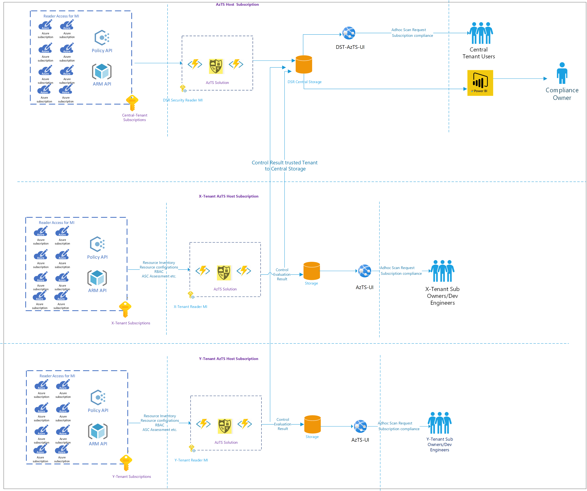

> The Azure Tenant Security Solution (AzTS) was created by the Core Services Engineering & Operations (CSEO) division at Microsoft, to help accelerate Microsoft IT's adoption of Azure. We have shared AzTS and its documentation with the community to provide guidance for rapidly scanning, deploying and operationalizing cloud resources, across the different stages of DevOps, while maintaining controls on security and governance.
<br>AzTS is not an official Microsoft product – rather an attempt to share Microsoft CSEO's best practices with the community..

# Cross- and multi-Tenant AzTS Onboarding

### [Overview](#Overview-1)
- [Onboard AzTS Solution per Tenant](#1-onboard-azts-solution-per-tenant)
- [Single AzTS setup to scan cross- and multi-tenant](#2-single-azts-setup-to-scan-cross--and-multi-tenant)
- [ Onboard AzTS Solution per Tenant with central visibility for scan result](#3-onboard-azts-solution-per-tenant-with-central-visibility-for-scan-result)


## Overview

Enterprise IT organizations creates multiple tenants to manage and deliver resources based on business needs. To get security visibility across multiple tenants, AzTS provides three kind of solutions.

1. Onboard AzTS Solution per Tenant: Standalone installation, scanning and reporting 
2. Single AzTS setup to scan cross- and multi-tenant: Use delegated identity on target tenant(s), scan from single AzTS setup
3. Onboard AzTS Solution per Tenant with central visibility for scan result   


## 1. Onboard AzTS Solution per Tenant

Standalone installation, scanning and reporting can be done by onboarding  AzTS solution per Tenant.
You will need to follow [setup steps]((../01-Setup%20and%20Getting%20started/Readme.md)) for each Tenant. 


Below diagram depicts high level flow for standlone setup.


## 2. Single AzTS setup to scan cross- and multi-tenant

Single AzTS setup can be used on trusted tenants and get visibility/reporting at single location.
AzTS leverages [Azure Lighthouse](https://docs.microsoft.com/en-us/azure/lighthouse/overview) delegated reader access to central scanning Managed Identity on cross-tenant subscriptions and perform AzTS scan seamlessly. 

Below diagram depicts high level flow for Azure Lighthouse approach


 >**Note:**  This approach has below limitations <br/>1. Azure Lighthouse delegated access is given at subscription level. Whenever  new subscription added into tenant, we need to provide delegated access on that sub <br/>2. Reader access using Azure Lighthouse can request API's that start with https://management.azure.com. However, requests that are handled by an instance of a resource type (such as Graph , RBAC details, Key Vault secrets access or storage data access) aren't supported with Azure Lighthouse. Due to this limitation, below AzTS controls will give false positive results<br/>* Azure_Subscription_AuthZ_Dont_Grant_Persistent_Access_RG <br/>* Azure_Subscription_AuthZ_Dont_Grant_Persistent_Access<br/>* Azure_Subscription_AuthZ_Dont_Use_NonAD_Identities<br/>* Azure_Subscription_AuthZ_Remove_Deprecated_Accounts <br/>3. AzTS UI will not be accessible to non-hosting (in below diagram Y and Z) tenant users. 


Follow below steps to onboard subscription from different tenants to AzTS scanning

1. Setup AzTS Solution on host tenant subscription

    Follow [setup steps]((../01-Setup%20and%20Getting%20started/Readme.md)) on host subscription. If you have already performed setup, you can skip this step. 

2. Get AzTS scanning MI principal id
   
   In step 3 of [setup]((../01-Setup%20and%20Getting%20started/Readme.md)), we have created central scanning user managed identity. We will need to navigate to MI resource to get principal id. 

   Go Azure Portal --> Subscription where central scanning MI resource created --> Click on MI Hosting RG --> Click on MI resource --> Copy object id 

3. Provide reader access to AzTS scanning MI on cross-tenant subscriptions using Azure Lighthouse. 
>> Note: Below step needs be performed only on cross tenant subscriptions and not on hosting tenant subscriptions where AzTS solution is installed.  

```PowerShell
# 1. Install Azure Lighthouse PS module
Install-Module -Name Az.ManagedServices -AllowClobber -Scope CurrentUser -repository PSGallery

# 2. Provide Reader Access on cross tenant subscription. 
# **Important Note:** Below step needs to be repeated for each cross-tenant subscription that needs to be scanned using AzTS solution

#  2.1 Set the context to target subscription 
    Set-AzContext -Subscription "<TargetSubscriptionId>"
#  2.2 Provide reader access using 
    $managedServiceDefinition = New-AzManagedServicesDefinition -Name "AzTS Scanner Managed Servcie" -Description "AzTS Scanning MI Access" -ManagedByTenantId "<HostTenantId>" -PrincipalId "<CentralScanningMIPrincipalId>" -RoleDefinitionId "acdd72a7-3385-48ef-bd42-f606fba81ae7" 
    #"acdd72a7-3385-48ef-bd42-f606fba81ae7" is reader role defination id
    New-AzManagedServicesAssignment -RegistrationDefinitionResourceId $managedServiceDefinition.Id

```

After access is provided to target subscription, next scheduled trigger will pick up subscription from cross tenant and perform scan. You can follow steps [here](../02-Security-compliance-and-monitoring-solution/ReadMe.md) to create security compliance dashboard.


## 3. Onboard AzTS Solution per Tenant with central visibility for scan result

To overcome limitation of second approach and to get visibility across trusted tenants, you can install standalone AzTS setup per tenant and leverage central repository to get security scan telemetry. 

Below diagram depicts high level flow for Azure Lighthouse approach



Step to configure central repository will be available soon....
 