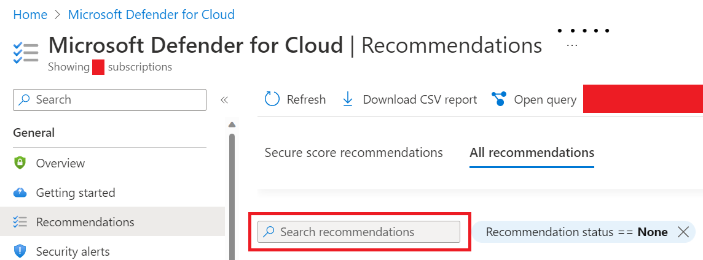
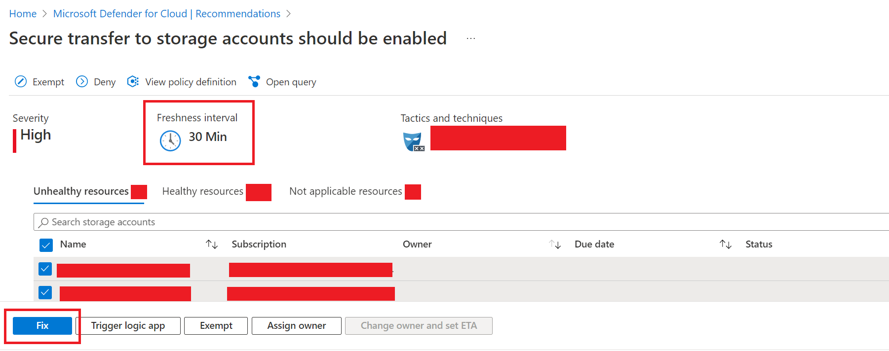

## Security controls covered by Azure Tenant Security (AzTS)

This page displays security controls that are automated via AzTS. Controls table listed under provide following details:
- ControlId and Description
- Dependent Azure API(s) and Properties
- Control spec-let

### Azure Services supported by AzTS

Below resource types can be checked for validating the security controls:

|Feature Name|Resource Type|
|---|---|
|[APIManagement](Feature/APIManagement.md)|Microsoft.ApiManagement/service|
|[AppService](Feature/AppService.md)|Microsoft.Web/sites|
|[CDN](Feature/CDN.md)|Microsoft.Cdn/profiles|
|[CloudService](Feature/CloudService.md)|Microsoft.ClassicCompute/domainNames|
|[ContainerRegistry](Feature/ContainerRegistry.md)|Microsoft.ContainerRegistry/registries|
|[CosmosDB](Feature/CosmosDB.md)|Microsoft.DocumentDB/databaseAccounts|
|[DataLakeAnalytics](Feature/DataLakeAnalytics.md)|Microsoft.DataLakeAnalytics/accounts|
|[DataLakeStore](Feature/DataLakeStore.md)|Microsoft.DataLakeStore/accounts|
|[DBForMySql](Feature/DBForMySql.md)|Microsoft.DBforMySQL/servers|
|[DBForMySqlFlexibleServer](Feature/DBForMySqlFlexibleServer.md)|Microsoft.DBforMySQL/flexibleServers|
|[DBForPostgreSQL](Feature/DBForPostgreSQL.md)|Microsoft.DBforPostgreSQL/servers|
|[EventHub](Feature/EventHub.md)|Microsoft.EventHub/namespaces|
|[HDInsight](Feature/HDInsight.md)|Microsoft.HDInsight/clusters|
|[HybridCompute](Feature/HybridCompute.md)|Microsoft.HybridCompute/machines|
|[KeyVault](Feature/KeyVault.md)|Microsoft.KeyVault/vaults|
|[KubernetesService](Feature/KubernetesService.md)|Microsoft.ContainerService/managedClusters|
|[LogicApps](Feature/LogicApps.md)|Microsoft.Logic/workflows|
|[NotificationHub](Feature/NotificationHub.md)|Microsoft.NotificationHubs/namespaces/notificationHubs|
|[NSG](Feature/NSG.md)|Microsoft.Network/networkSecurityGroups|
|[RedisCache](Feature/RedisCache.md)|Microsoft.Cache/Redis|
|[ServiceBus](Feature/ServiceBus.md)|Microsoft.ServiceBus/namespaces|
|[ServiceFabric](Feature/ServiceFabric.md)|Microsoft.ServiceFabric/clusters|
|[SQLManagedInstance](Feature/SQLManagedInstance.md)|Microsoft.Sql/managedInstances|
|[SQLServer](Feature/SQLServer.md)|Microsoft.Sql/servers|
|[Storage](Feature/Storage.md)|Microsoft.Storage/storageAccounts|
|[Subscription](Feature/SubscriptionCore.md)|
|[TrafficManager](Feature/TrafficManager.md)|Microsoft.Network/trafficmanagerprofiles|
|[VirtualMachine](Feature/VirtualMachine.md)|Microsoft.Compute/virtualMachines|
|[VirtualMachineScaleSet](Feature/VirtualMachineScaleSet.md)|Microsoft.Compute/virtualMachineScaleSets|
|[VirtualNetwork](Feature/VirtualNetwork.md)|Microsoft.Network/virtualNetworks|

## Externally Scanned controls in Azure Tenant Security (AzTS)

There are certain controls that cannot be effectively evaluated by AzTS (due to various limitations for e.g. some controls requires VM instances to be in running state) for such controls AzTS will put verification result as 'ExtScanned'. And effective verification result of such controls should be determined based on external feeds later (if available). 

As verification result for such controls depends on other sources and get determined outside AzTS boundary. So, in AzTS UI, controls with verification result 'ExtScanned' are excluded from compliance. By default, such controls will not be listed in scan results view however user can use filter ('AzTS-based controls only') provided in AzTS UI to list these controls.

### List of externally scanned controls

Following controls in AzTS are currently externally scanned:

| ControlId | DisplayName | Description |
|-----------|-------------|-------------|
| Azure_VirtualMachine_SI_Enable_Monitoring_Agent | All VMs must have Monitoring Agent enabled | All VMs must have Monitoring Agent enabled |
| Azure_VirtualMachine_SI_Enable_Vuln_Solution | Install DSRE Qualys Cloud Agent on assets | Vulnerability assessment solution should be installed on VM |
| Azure_VirtualMachine_SI_Missing_OS_Patches | Patch assets to protect against vulnerabilities | Virtual Machine must have all the required OS patches installed |
| Azure_VirtualMachine_SI_Enable_Antimalware | Ensure all devices have anti-malware protection installed and enabled | Antimalware must be enabled with real time protection on Virtual Machine |
| Azure_VirtualMachine_SI_Enable_Sense_Agent | Ensure Sense Agent is installed and healthy | Sense Agent provides Threat and Vulnerability Management (TVM) data and other enhanced telemetry to the backend Microsoft Defender Advanced Threat Protection (MDATP) instance |

## List of controls that depends on Microsoft Defender for Cloud (MDC) in Azure Tenant Security (AzTS)

| ControlId | DisplayName | Description | MDC Recommendation(s) |
|-----------|-------------|-------------|-----------------------|
| Azure_AppService_DP_Dont_Allow_HTTP_Access | Use HTTPS for app services | App Service must only be accessible over HTTPS | Web Application should only be accessible over HTTPS, Function App should only be accessible over HTTPS, API App should only be accessible over HTTPS(Not Present in MDC Recommendations) |
| Azure_AppService_DP_Use_Secure_TLS_Version | Use Approved TLS Version in App Service | Use approved version of TLS for the App Service | TLS should be updated to the latest version for web apps, TLS should be updated to the latest version for function apps, TLS should be updated to the latest version for API apps |
| Azure_AppService_DP_Use_Secure_FTP_Deployment | App Services should use secure FTP deployments | App Services should use secure FTP deployments | FTPS should be required in web apps, FTPS should be required in function apps |
| Azure_Storage_AuthN_Dont_Allow_Anonymous | Ensure secure access to storage account containers | The Access Type for containers must not be set to 'Anonymous' | Storage account public access should be disallowed |
| Azure_Storage_DP_Encrypt_In_Transit | Enable Secure transfer to storage accounts | HTTPS protocol must be used for accessing Storage Account resources | Secure transfer to storage accounts should be enabled |
| Azure_VirtualMachine_DP_Enable_Disk_Encryption | Disk encryption should be applied on virtual machines | Disk encryption must be enabled on both OS and data disks for Windows Virtual Machine | Virtual machines should encrypt temp disks, caches, and data flows between Compute and Storage resources |
| Azure_VirtualMachine_SI_MDC_OS_Vulnerabilities | Virtual Machine must be in a healthy state in Microsoft Defender for Cloud |Virtual Machine must be in a healthy state in Microsoft Defender for Cloud | Machines should be configured securely |
| Azure_VirtualMachine_SI_MDC_Recommendations | Virtual Machine must implement all the flagged MDC recommendations | Virtual Machine must implement all the flagged MDC recommendations | Virtual machines should encrypt temp disks, caches, and data flows between Compute and Storage resources, Adaptive application controls for defining safe applications should be enabled on your machines, Machines should have a vulnerability assessment solution |
| Azure_VirtualMachine_SI_Enable_Vuln_Solution | Install DSRE Qualys Cloud Agent on assets | Vulnerability assessment solution should be installed on VM | Machines should have a vulnerability assessment solution |
| Azure_VirtualMachine_NetSec_Dont_Open_Restricted_Ports | Management ports must not be open on machines | Do not leave restricted ports open on Virtual Machines | Management ports of virtual machines should be protected with just-in-time network access control |
| Azure_VNet_NetSec_Configure_NSG | Associate Subnets with a Network Security Group | NSG should be used for subnets in a virtual network to permit traffic only on required inbound/outbound ports. NSGs should not have a rule to allow any-to-any traffic | Subnets should be associated with a network security group |
| Azure_Subscription_AuthZ_Remove_Deprecated_Accounts | Remove Orphaned accounts from your subscription(s) | Deprecated/stale accounts must not be present on the subscription | Deprecated accounts should be removed from subscriptions | 
| Azure_KubernetesService_Deploy_Use_Latest_Version | [Preview]: Kubernetes Services should be upgraded to a non-vulnerable |Kubernetes version | The latest version of Kubernetes should be used | Kubernetes Services should be upgraded to a non-vulnerable Kubernetes version |
| Azure_RedisCache_DP_Use_SSL_Port | Non-SSL port must not be enabled for Redis Cache | Non-SSL port must not be enabled for Redis Cache | Redis Cache should allow access only via SSL |
| Azure_ServiceFabric_DP_Set_Property_ClusterProtectionLevel | The ClusterProtectionLevel property must be set to EncryptAndSign for Service Fabric clusters |The ClusterProtectionLevel property must be set to EncryptAndSign for Service Fabric clusters | Service Fabric clusters should have the ClusterProtectionLevel property set to EncryptAndSign |
| Azure_SQLDatabase_AuthZ_Use_AAD_Admin | Use AAD Authentication for SQL Database | Enable Azure AD admin for the SQL Database | SQL servers should have an Azure Active Directory administrator provisioned |
| Azure_SQLDatabase_DP_Enable_TDE | Enable Transparent Data Encryption on SQL databases | Enable Transparent Data Encryption on SQL databases | Transparent Data Encryption on SQL databases should be enabled |
| Azure_Storage_NetSec_Restrict_Network_Access | Ensure that Firewall and Virtual Network access is granted to a minimal set of trusted origins | Ensure that Firewall and Virtual Network access is granted to a minimal set of trusted origins |
| Azure_VirtualMachine_SI_Deploy_Data_Collection_Extension | [Preview]: Install Network data collection agents | Network traffic data collection agent should be installed on Windows/Linux virtual machines |

## Frequently Asked Questions (FAQ)

 

**Even after remediating my resource, it is still showing as failed against controls in AzTS UI. The controls depends on MDC Assessment. What should I do?**

**NOTE:** *Kindly make sure that the resource(s) is(are) already fixed. The controls which depends on MDC assessment could be found [here](#list-of-controls-that-depends-on-microsoft-defender-for-cloud-mdc-in-azure-tenant-security-azts).* 

1. Go to **Azure Portal**.
2. Search for **Microsoft Defender for Cloud** and **open** that.

    

3. Click on **Recommendation under the General tab**, in the left side panel.

    

4. Click on the **All Recommendations**.
5. Search for the related [recommendations](#list-of-controls-that-depends-on-microsoft-defender-for-cloud-mdc-in-azure-tenant-security-azts) and open it.

    

6. Check the list of **unhealthy resources** to see if your resource is present in that list or not.
7. If your resource(s) is not present in unhealthy resources list, run the scan from AzTS UI and check the status of your resource(s).
7. If your resource(s) is present in **unhealthy resources list** and **'Fix' button is available** in the bottom, select the resource(s) that you need to remediate and click on 'Fix' button and wait till your resource(s) show up in **healthy resources list**.

    
 
8. If your resource(s) is present in **unhealthy resources list** and **'Fix' button is not available** in the bottom, you have to wait till the MDC evaluation is refreshed and wait till your resource(s) show up in **healthy resources list**. You can find the **refresh interval** at the top. 
10. Once your resource(s) appear under healthy resources list, run the scan from AzTS UI to check the status of your resource(s).